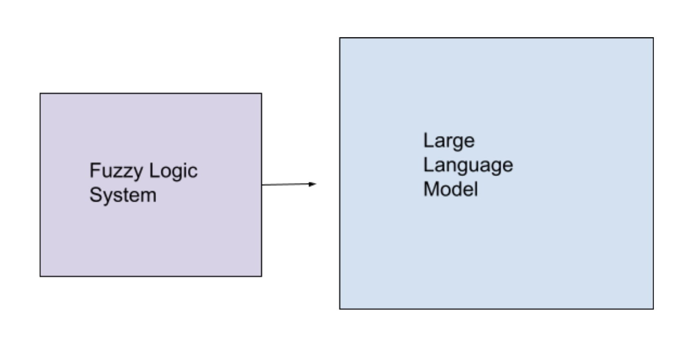

# Domestic Violence Chatbot

## Fuzzy Logic to Emulate Empathy 

### Benifits of using Fuzzy Logic as an additional system apart from a LLM

#### 1. Recongize emotional states in degrees

Instead of it being "sad"/"happy"/etc  
It would be: 

- "slightly sad"
- "very sad"
- "somewhat anxious"
- "extremly anxious"
- etc

#### 2. Contextual decision making with fuzzy sets

- Adaptive Response Levels

Example:  
*Emotion Detected:* Moderately Anxious 
*Chatbot Response Angled:* Provide mild reassurance 

- Empathy Scaling 

#### 3. Adjusting Tone and Language with Fuzzy Logic

The system does not treat emotions as binary (e.g., "sad" or "happy") but instead recognizes degrees of emotions, allowing for subtle emotional understanding. Membership functions for variables like sadness and frustration create fuzzy sets, enabling the system to interpret inputs such as:

- "slightly sad" (low sadness)
- "very sad" (high sadness)
- "somewhat anxious" (moderate frustration)
- "extremely anxious" (high frustration)

The fuzzy logic control system adjusts the tone and language of responses based on these nuanced emotional states.  
*For example:*

- A low empathy score might trigger concise, encouraging statements like: *"I'm here to help. Tell me more about what you're feeling."*
- A moderate empathy score results in reassurance: *"It seems like you're going through a tough time. I'm here to support you."*
- A high empathy score offers deep emotional validation: *"I understand how difficult this must be for you. Let’s work together to find a way forward."*

#### 4. Handling Vague Emotional Expression 

Humans often express emotions ambiguously or with mixed signals, such as *"I'm kind of upset, but I don't know why"* or *"I feel a little off."* The system handles these vague expressions by mapping them onto fuzzy sets that capture overlapping emotional states.  
For instance:

- **"Kind of upset"** might overlap between "low sadness" and "moderate sadness."
- **"A little off"** could register as both "low sadness" and "low frustration."

Fuzzy logic ensures that the chatbot can process these vague inputs and still generate meaningful responses.  
*For example:*
- If sadness is low but frustration is moderate, the response might focus on mild reassurance: *"It sounds like you're feeling a bit overwhelmed. Let's take it step by step."*
- If sadness is high and frustration is low, the response might emphasize empathy: *"I'm here to support you during this tough time. Let's talk about it."*

This flexibility in handling ambiguity builds a more human-like interaction style, making the user feel heard and understood.

#### 5. Building Trust: Human-like Interaction

The system's human-like interaction capabilities rely on dynamic responses that mirror genuine empathy. By combining contextual decision-making with nuanced emotional scaling, the chatbot creates interactions that feel personal and trustworthy.

---

## DIET 

### Intents 

An intent represents the purpose or goal of a user's input. It answers the question: *What is the user trying to achieve?*

- **Seeking Help:** The user wants to get immediate assistance.
- **Sharing Experiences:** The user wants to talk about their situation.
- **Asking for Resources:** The user is looking for shelters, legal aid, or hotlines.
- **Safety Planning:** The user wants advice on creating a safety plan.
- **Requesting Emotional Support:** The user needs reassurance or coping strategies.  

*Example:*  
User input: *"I need help getting out of an abusive relationship."*

**Intent:** Seeking Help

### Entities

An entity represents specific information extracted from the user's message. Entities provide details that refine or contextualize the intent. These can include names, locations, dates, times, or any other specific data.  

*For example:*

- **Type of Abuse:** Physical, emotional, financial, etc.
- **Location:** City or region where the user needs help.
- **Urgency Level:** "Now," "soon," "in a few weeks."

### Intent and Enitities Together

**User Input:** *"Can you tell me about shelters in Chicago?"*  
**Intent:** Asking for Resources  
**Entities:** 

- **Resource Type:** Shelters
- **Location:** Chicago

---

## Memory 

The chatbot will have a memory system to keep track of abuse documents like: 

- Screenshots of messages
- Emails
- Photos
- Videos

### How it will work 

The user would say something like: *"I want to upload a screenshot of abusive messages."*  
The system's DIET intent classification system would then detect: **upload_evidence**

